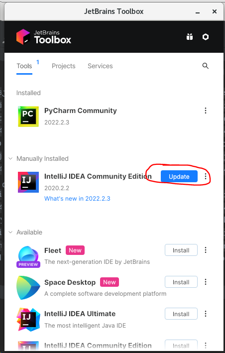

Merhaba Herkese,

Centos sanal makinalardaki 2020 sürümünü 2022 ye yükseltmek için çok kolay bir yol buldum: JetBrains Toolbox

İlgilenen var ise dosyadaki adımları uygulayabilir:

## Jetbrains Toolbox setup on Linux

1. `wget https://download-cdn.jetbrains.com/toolbox/jetbrains-toolbox-1.26.2.13244.tar.gz` download from link
2. `tar -xvf jetbrains-toolbox-1.26.2.13244.tar.gz`  extract tar
3.  `mv jetbrains-toolbox-1.26.2.13244/ jetbrains` to reach it easily
4.  `cd jetbrains` open file
5.  `./jetbrains-toolbox` run jetbrains-toolbox
6. from opened toolbox, click update 2022 for pycharm. (In the image, showed for Intelij. Do it same this for pycharm)

7. Open pycharm 2022 from applications
8. If everything is working well, you can uninstall Pycharm 2020 from Toolbox.